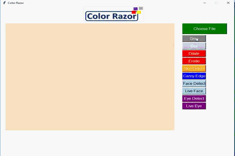

# Color Razor

**Current App**

## Face and Eye Detection Demo

## To Run the App
- Either download or clone this repo.
- Run `Color-Razor.py` 
- Press **Choose File** to choose a picture from your computer, and 
- Use any options you would like by clicking the buttons.
- You can save the edited pictures by clicking the **Save** buttons next to each option. Images will be saved to **images** folder. 

# Note
You can do **live camera face and eye detection** by clicking the corresponding buttons. To quit from camera capture, simply click "q".
